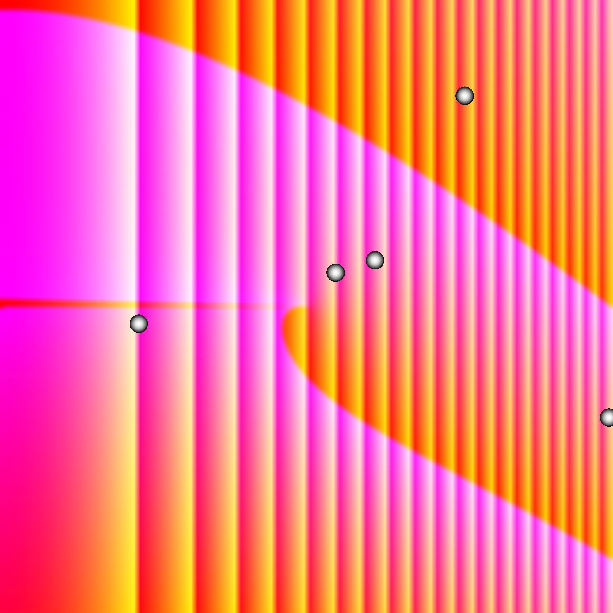

# Image Editing Project

## Overview

This project is an interactive image generator written in C# that utilizes a native C++ library for image processing. The application allows users to generate and manipulate images using a series of commands, which can be chained together using a pipe (`|`) character. The project was developed as part of a university coursework in advanced programming with a focus on interoperability.

## MANUAL: 

1: Copy the repository
2: Open the project in Visual Studio or other IDE
3: Set MinImage as a startup project if not set already
4: Run the project and type "Help" to see avaliable options 

## Features

### Special Commands

- **Help**: Lists available commands along with their argument descriptions. This command does not work within a command chain.

### Generating Commands

- **Input ****`filename`**: Loads an image from disk.
- **Generate ****`n`**** ****`width`**** ****`height`**: Generates `n` images of the given `width` x `height` dimensions with random patterns using the native library.

### Processing Commands

- **Output ****`filename_prefix`**: Saves the processed images to disk.
- **Blur ****`w`**** ****`h`**: Applies a `w` x `h` blur to the images.
- **RandomCircles ****`n`**** ****`r`**: Draws `n` circles with radius `r` at random positions.
- **Room ****`x1`**** ****`y1`**** ****`x2`**** ****`y2`**: Draws a filled rectangle based on normalized coordinates (0 to 1).
- **ColorCorrection ****`red`**** ****`green`**** ****`blue`**: Adjusts color balance.
- **GammaCorrection ****`gamma`**: Applies gamma correction.

## Command Syntax

Users enter a generating command followed by one or more processing commands, separated by the `|` character.

```
Generate 10 1024 1024 | Blur 4 4 | Output Image
```

The example above generates 10 images of size 1024x1024, applies a 4x4 blur to each, and saves them as "Image1.jpeg", "Image2.jpeg", etc.

## Error Handling

The system detects syntax errors in the command chain before execution begins. If an error is found, the process does not start.

## Progress Reporting

Each function provides progress updates in increments of 1%, visually representing each command's progress separately. Example output:

```
[######|######|###---|------|------] 50%
```

## Aborting Execution

The user can press `x` during execution to stop the command chain safely. The system ensures proper resource deallocation when aborting.


## Example outputs 

Basic image without filters:



